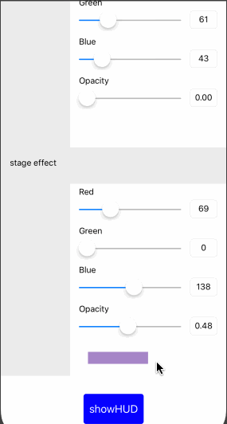
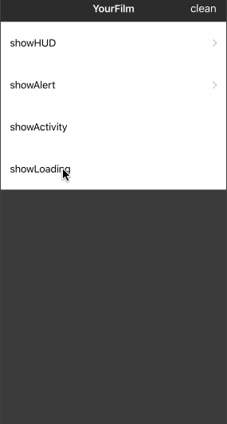

<div align=center></div>

[](#)
[](#) 
[](#)
[](#) 


YourFilm 是一个便利的，功能丰富的 iOS 视图窗口工具，她具备了一般 HUD 的展示功能，同时提供了更丰富的配置，不再局限于单调的黑白，还可以自定义出场动画与结束动画。


## 效果预览

说明 | Gif |
----|------|
文本效果<br/>  |   |
loading效果<br/>  |   |


## 要求

- iOS 9.0+
- Xcode 10+
- Swift 4.0+

## 安装

### CocoaPods

```ruby
target '<Your Target Name>' do
    pod 'YourFilm'
end
```

## 使用

### 文字提示使用示例代码

```Swift
  // 定义文本内容
  let character = HUD.init(content: HUDContent.label("为了更美好的明天而战~~~~~~", textColor: .white))
      
  //快捷调用
  YourFilm.show(character)
  
  //添加自定义背景
  var scenery = Scenery()
  scenery.spaceEffect = .color(faceBgColorSelector.color)
  scenery.stageEffect = .color(stageBgColorSelector.color)
  YourFilm.show(character, scenery: scenery)
```
### 自定义图片loading
```
  let image = UIImage(named: "com_loading_red")!
  YourFilm.showLoading(image: image, title: "正在加载", onView: self.tableView)
```

### 系统样式loading
```
  YourFilm.showActivityIndicator(onView: self.tableView)
```


## 补充

该仓库保持随时更新，后续还会有更丰富的展示风格。使用过程中，有任何问题或者建议，可以通过以下方式联系我：</br>
邮箱：504739540@qq.com </br>

## License

YourFilm is released under the MIT license.
